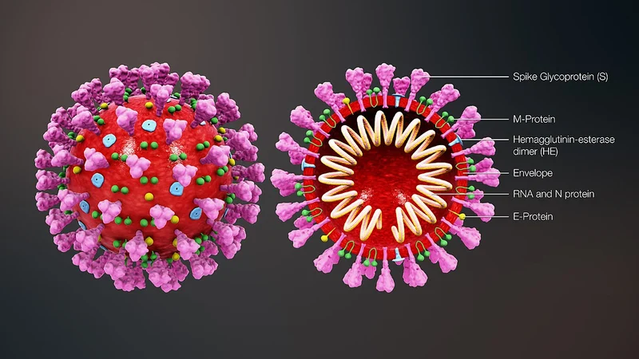
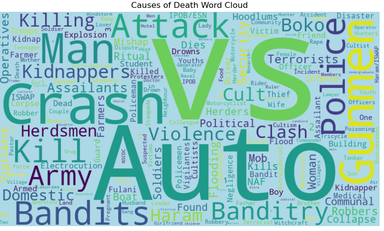

<!--Section 1: Introduce your self-->
## ABOUT ME

I’m a Data Analyst, Biochemist, and Researcher with a strong passion for turning complex data into clear, actionable insights. With a scientific background and a business mindset, I bridge the gap between data, research, and strategy to solve real-world problems.

<!--Mention your top/relevant skills here - core and soft skills-->
## SKILLS

*I specialize in acquiring, analyzing, and interpreting data to deliver actionable insights and effective solutions. My expertise lies in leveraging data to support informed decision-making and strategic growth. ;*

** ✅ Data Analysis & Visualization.**
I transform raw, messy data into meaningful insights using Python, SQL, Excel, and Power BI. I enjoy exploring data, identifying patterns, and building clear dashboards that tell a story and support smart decision-making. 

** ✅ Research & Scientific Thinking.**
With a strong background in biochemistry and research, I approach problems analytically and methodically. I’m skilled in experimental design, data interpretation, and applying statistical thinking to both scientific and business questions.

** ✅ Programming & Data Tools.**
I work confidently with Python for data analysis and automation, and SQL for querying and managing databases. I write clean, well-documented code and value reproducibility and clarity in every project.

** ✅ Business Analysis & Consulting.**
I help businesses turn data into strategy by translating technical findings into practical insights. My work focuses on performance analysis, process improvement, and evidence-based recommendations that create real impact.

<!--Section 2: List 3-4 key projects-->
## MY PROJECT 

*A glimpse of some of the projects I've been working on.*

The global aircrash talks more on the crashes that occured between 1908-2024

[Read More](https://github.com/ruthabimbola1234-cell/Global-Air-crash-Analysis-App)

[streamlit image](https://global-air-crash-analysis-app-ne8hx24gpojpqp9mmoelm4.streamlit.app/)

## PROJECT  2

[Read More](https://github.com/ruthabimbola1234-cell/abby6)

## PROJECT  3

[Read More](https://github.com/ruthabimbola1234-cell/Nigeria-incidents_app)

## CONTACT DETAILS

*Let’s connect and see how we can make a difference together!*
<table>
  <tbody>
    <tr>
      <td>📧</td>
      <td><a href="mailto:ruthabimbola1234@gmail.com">ruthabimbola1234@gmail.com</a></td>
    </tr>
    <tr>
      <td>📞</td>
      <td>(234) 703-227-0334</td>
    </tr>
    <tr>
      <td>📍</td>
      <td>Lagos, Nigeria</td>
    </tr>
    <tr>
  </tbody>
</table>

   

